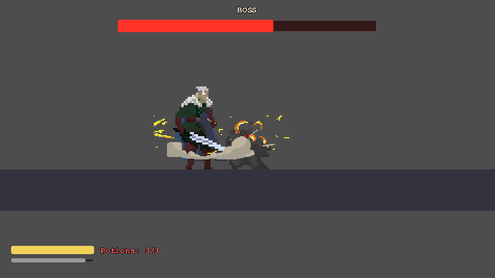

# 2D Action Platformer (Souls-like / Boss Rush)

โปรเจกต์เกม 2D Action Platformer สไตล์ Souls-like / Boss Rush ที่เน้นระบบ Combat การปัดป้อง (Parry) ที่ดุดัน รวดเร็ว และสะใจ (ได้แรงบันดาลใจจาก Hollow Knight และ Sekiro: Shadows Die Twice) พัฒนาด้วย Godot Engine

##  Gameplay Showcase

| ผู้เล่น (Pyke) | ศัตรูระดับบอส (Enemy) |
| :---: | :---: |
| .png) |  |

| จังหวะปะทะดาบสุดเดือด | การปัดป้องโปรเจกไทล์ |
| :---: | :---: |
|  |  |

---
